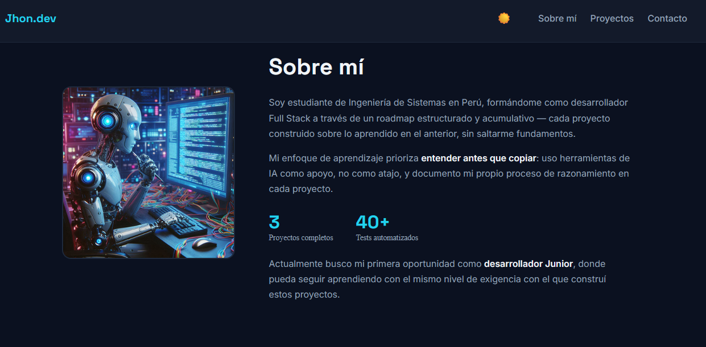

# Portafolio — Jhon

Portafolio profesional construido con React + Vite, mostrando mis proyectos
de formación como desarrollador Full Stack (Django + React).

🔗 **Demo en vivo:** https://portfolio-kappa-neon-66.vercel.app/

## Capturas

## Stack técnico

- React 18 + Vite
- CSS puro con variables CSS (sin frameworks de estilos)
- CSS Grid y Flexbox para layouts responsive sin media queries innecesarias
- Despliegue continuo con Vercel

## Estructura del proyecto

Ver la organización completa de componentes en `src/components/`,
separando componentes de layout, secciones y UI reutilizable.

## Cómo correrlo localmente

\`\`\`bash
git clone https://github.com/jhonbriandev/portafolio.git
cd portafolio
npm install
npm run dev
\`\`\`

## Proyectos destacados

- [Sistema de Triage de Tickets con IA](https://github.com/jhonbriandev/triage-ai)
- [Blog con React + API REST](https://github.com/jhonbriandev/my-blog)
- [Blog con Django](https://github.com/jhonbriandev/my-blog)

## Contacto

📧 jhonbriandev@gmail.com| [LinkedIn](https://linkedin.com/in/jhon-brian-ac)
